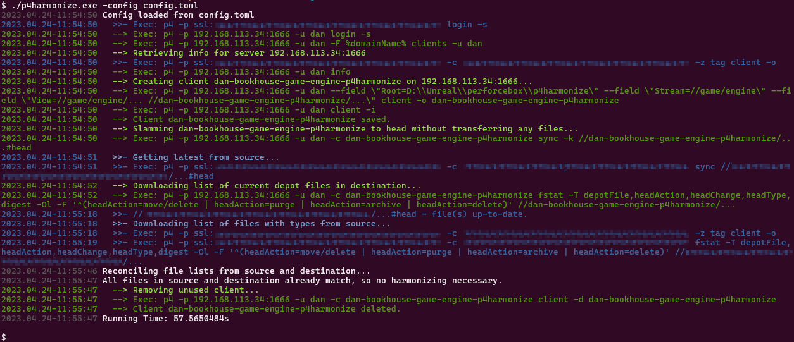

# p4harmonize

## Important Updates

- As of 2023-05-16, this depot has been transferred from `proletariatgames/p4harmonize` to `danbrakeley/p4harmonize`.
- As of v0.5.0, bash will no longer be required to run p4harmonize on Windows.
- Also, the output now uses colors to much better effect (see example image below).

## Overview

`p4harmonize` is a tool for mirroring a stream's head revision from one perforce server to another. This includes reconciling files, fixing differences in file name/path capitalization, fixing the file type, and fixing improperly checked in %AppleDouble files.

`p4harmonize` was built with Unreal Engine source in mind, where the Epic licensee perforce server is used as the source, and a dedicated stream on a project's perforce server is used as the destination. It is intended to be used with a setup similar to [the one recommended by Epic](https://docs.unrealengine.com/4.26/en-US/ProgrammingAndScripting/ProgrammingWithCPP/DownloadingSourceCode/UpdatingSourceCode/#integrating,merging,andbranching). For example, a recent Unreal project I worked on had the following setup:

name | description
--- | ---
`//proj/engine_epic` | exact copy of a specific UE version from Epic's perforce server (p4harmonize targets this stream, no project-specific changes should ever end up here)
`//proj/engine_merge` | dedicated space for a human to merge main with new engine drops; ideally QA will sign off on a build from this branch before the merged engine changes are brought to main
`//proj/main` | our mainline; lots of people work here, so a broken build can be very costly



## Case-sensitivity

Perforce servers can run in case sensitive or case insensitive modes. When the destination server is running in case insensitive mode, file casing issues can't be fixed with a single move command. Instead, files must first be deleted, then re-added with the correct case. `p4harmonize` supports doing this work, however it requires the user to run `p4harmonize` twice. If you end up in this situation, `p4harmonize` will explain what to do as the first run finishes.

## Install

You can download the latest Windows executable from the [releases page](https://github.com/danbrakeley/p4harmonize/releases), or you can build it yourself.

To build your own, see the [Developement Setup](#development-setup) section below.

## Usage

`p4harmonize` requires a configuration TOML file, and by default will look for `config.toml` in the current directory. This can be overridden by passing `-config <file>`.

Here's an example `config.toml` file:

```toml
# source is the perforce server you are pulling from, ie Epic's licensee server.
[source]
p4port = "ssl:perforce.example.com:1667"
p4user = "user"
p4client = "user-UE4-Release-Latest-Minimal" # this needs to exist before running p4harmonize

# destination is the perforce server you want to update so that it matches the source
[destination]
p4port = "perforce.local:1666"
p4user = "localuser"
new_client_name = "localuser-harmonize"   # this will be created by p4harmonize
new_client_root = "d:/p4/local/harmonize" # this will be created by p4harmonize
new_client_stream = "//test/engine_epic"  # this needs to already exist
```

`p4harmonize` connects to each server, requests file lists from each, and determines what work needs to be done. If everything is already in sync, then it quickly reports the status and stops. If there is work to be done, then it creates a changelist and begins adding its fixes to it.

While it runs, it outputs status updates and every individual `p4` command it is running so you can follow along.

When it is done, there will be a changelist that must be submitted by hand, giving you a chance to verify the work.

`p4harmonize` will never submit a changelist on its own.

## Runtime requirements

`p4harmonize` requires the following commands to be in your path:

- `p4`/`p4.exe`, aka the [Helix Command-Line Client](https://www.perforce.com/downloads/helix-command-line-client-p4)

## Development setup

- Ensure you have all the [Runtime requirements](#runtime-requirements)
- Ensure you have a [recent version of Go (1.17+)](https://go.dev/dl/)
  - Ensure that $GOPATH/bin is added to your $PATH environment variable.
- To run all the tests, you'll want to have Docker installed
  - On Windows and Mac, you'll want [Docker Desktop](https://www.docker.com/products/docker-desktop)
  - On Linux you'll want [Docker Server](https://docs.docker.com/engine/install/#server).
- Clone the github repo:
  ```text
  git clone https://github.com/danbrakeley/p4harmonize.git
  ```
- Open a bash session (works with git-bash on Windows) in the `p4harmonize` folder that git created in the previous step and run `scripts/setup.sh`
  - This ensures Go is installed and ready
  - This builds [Mage](https://magefile.org) into your $GOPATH/bin folder

## Build/run

`p4harmonize` uses [Mage](https://magefile.org) to automate building and testing tasks. If you've never used Mage before, running `mage` with no arguments will display all the build targets found in the `magefile.go` file in the current folder. It should look something like this:

```text
$ mage
Targets:
  build       tests and builds the app (output goes to "local" folder)
  longTest    runs a fresh build of p4harmonize against test files in docker-hosted perforce servers.
  run         runs unit tests, builds, and runs the app
  testDown    brings down and removes the docker containers started by TestUp.
  testUp      brings up fresh perforce servers via Docker, each with a super user named "super" (no password).
```

### Mage usage notes

- If your shell can't find `mage`
  - make sure your `$GOPATH/bin` folder is in your `$PATH`
  - make sure there's a `mage` executable in your `$GOPATH/bin` folder
  - if `mage` is missing, then re-run `scripts/setup.sh`
- Mage targets are not case sensitive, so `mage longTest` and `mage longtest` will run the same target.

## Contributing

Before opening a pull request, please run `mage longtest` and make sure it is passing.

If your PR includes performance improvements, please include some benchmarks that show the benefits of your changes.

## Special Thanks!

Thanks to [Bohdon Sayre](https://github.com/bohdon) and [Jørgen P. Tjernø](https://github.com/jorgenpt) for contributing time and code to help me fix my bugs and dramatically improve performance!

## TODO:

- run longtest via github actions?
- test on a Mac (maybe with github actions?)
